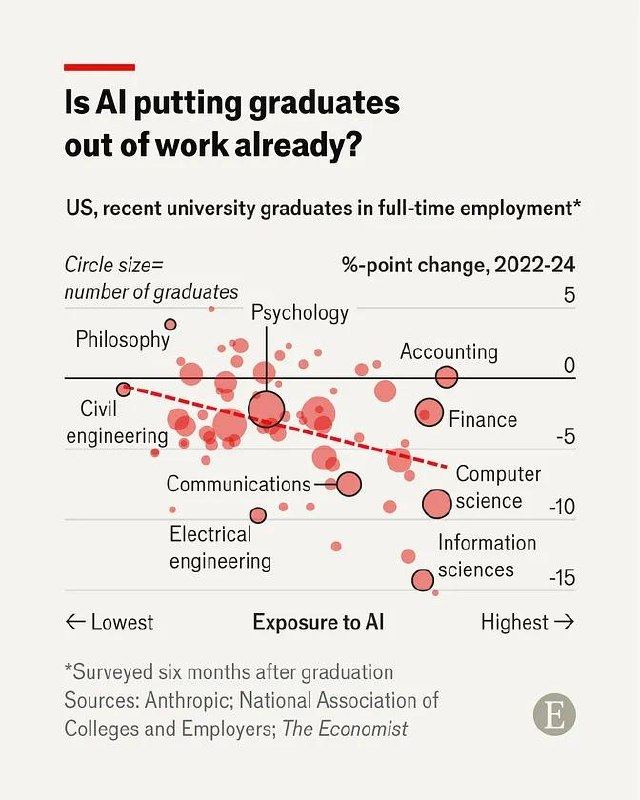

# Is AI putting graduates out of work already?

**Date:** May 13, 2026  
**Source:** The Economist  
**URL:** https://www.economist.com/finance-and-economics/2026/05/13/is-ai-putting-graduates-out-of-work-already

## Key Findings

Chart shows relationship between AI exposure by field and employment changes for US university graduates (2022-24, surveyed 6 months after graduation):

- **Fields with highest AI exposure** (Information sciences, Computer science): 10-15 percentage point drops in full-time employment
- **Finance, Accounting**: Moderate declines (around 5 points) despite moderate AI exposure  
- **Civil engineering, Electrical engineering, Communications**: Declining despite lower-to-moderate AI exposure
- **Psychology, Philosophy**: Slight increases despite some AI exposure

**Clear negative correlation** between AI exposure and employment outcomes for recent graduates.

## Chart

Chart data from Anthropic and National Association of Colleges and Employers.

## Tags

#ai-impact #employment #graduates #labor-market #economist
