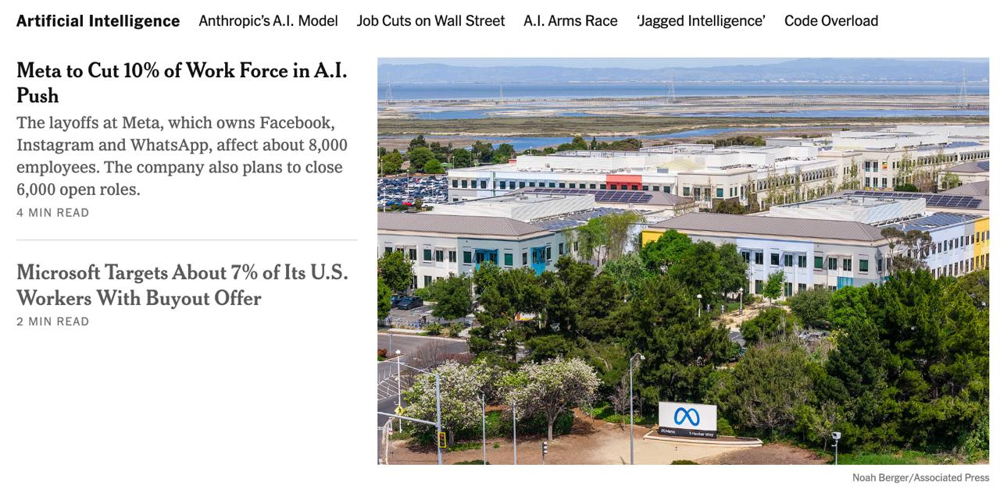
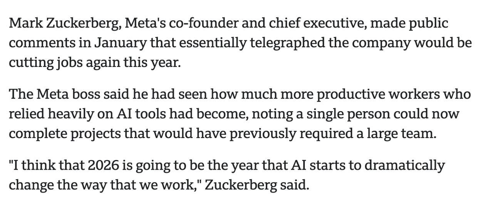

# AI and job cuts: Meta + Microsoft (NYT screenshots)

Screenshots capturing mainstream reporting that frames 2026 as an inflection year for AI-driven productivity and workforce reductions.

## Links

- **Source context**: New York Times (screenshots shared in chat)
- **BBC explainer**: (link requested — not yet provided)

## What the screenshots show

### 1) Meta workforce reduction framed as AI push

Headline shown:
- **“Meta to Cut 10% of Work Force in A.I. Push”**

With subhead:
- Layoffs affecting about **8,000 employees**
- Plans to close **6,000 open roles**

Also shown alongside:
- **“Microsoft Targets About 7% of Its U.S. Workers With Buyout Offer”**

### 2) Zuckerberg quote: productivity → fewer people

Quote excerpt shown:

> “The Meta boss said he had seen how much more productive workers who relied heavily on AI tools had become, noting a single person could now complete projects that would have previously required a large team.
>
> ‘I think that 2026 is going to be the year that AI starts to dramatically change the way that we work,’ Zuckerberg said.”

## Notes

- Rufus requested citing a separate BBC article for the explanatory text; once you share the BBC link, I’ll add it to this ref and (optionally) quote it.

## Related

- [[hbr-ai-intensifies-work]]
- [[economists-ai-adoption]]
- [[marketing365-ai-impact]]
- [[meta-muse-spark-msl]]
