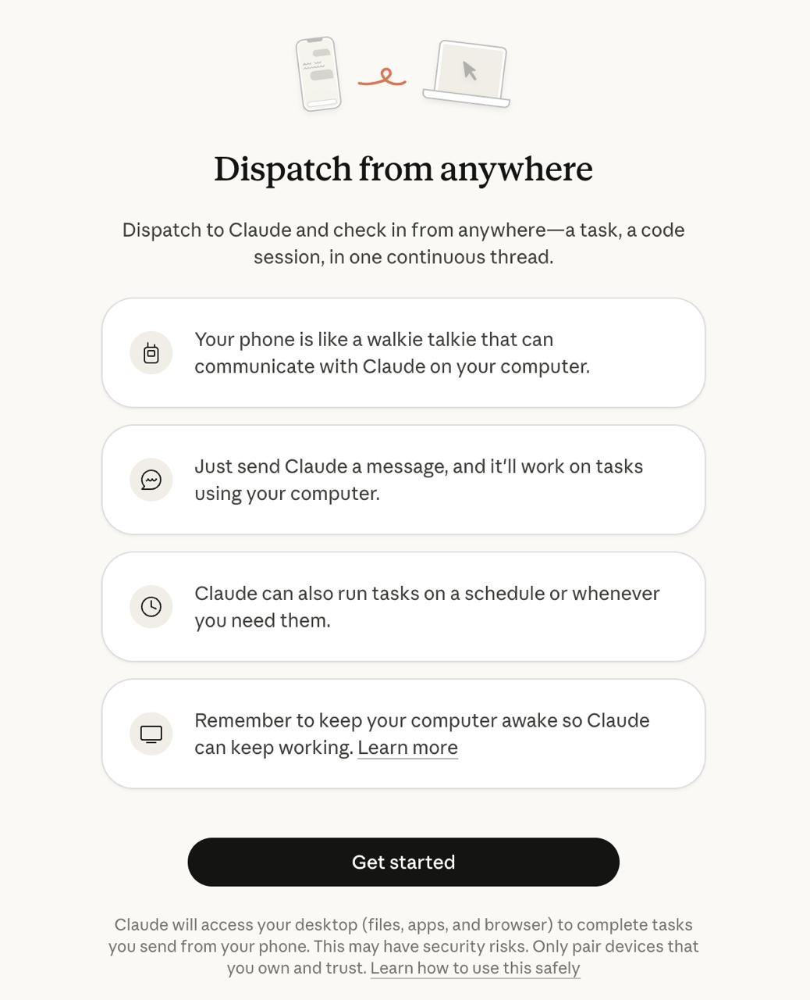

# Claude Dispatch

Anthropic's response to OpenClaw and agents: remote task assignment with computer use on macOS.

## Links

- **Released**: March 17, 2026 (Dispatch), March 24, 2026 (Computer Use announcement)
- **Availability**: Pro and Max subscribers on macOS
- **Feature**: Part of Claude Cowork
- **CNBC Coverage**: https://www.cnbc.com/2026/03/24/anthropic-claude-ai-agent-use-computer-finish-tasks.html

## Overview

Claude Dispatch lets users assign tasks to Claude from their phone and have them run on their desktop Mac while away. Combined with Computer Use capabilities, it represents Anthropic's competitive response to the viral OpenClaw platform.

**Tagline**: "Dispatch from anywhere — Dispatch to Claude and check in from anywhere—a task, a code session, in one continuous thread."

## Key Features

### Dispatch from Anywhere
- 📱 **Your phone is like a walkie talkie** that can communicate with Claude on your computer
- 💬 **Just send Claude a message**, and it'll work on tasks using your computer
- ⏰ **Claude can run tasks on a schedule** or whenever you need them
- 💻 **Remember to keep your computer awake** so Claude can keep working

### Computer Use
Announced March 24, 2026, Claude can now:
- Open apps on your computer
- Navigate web browsers
- Fill in spreadsheets
- Export files (e.g., pitch deck as PDF)
- Attach files to meeting invites
- Control your entire computer remotely

### Workflow
1. Text your desktop AI from coffee shop
2. Order your coffee
3. Drink it slowly
4. Come back to finished work

## Context: Response to OpenClaw

From CNBC:
> "The latest update from Anthropic underscores the push from AI firms to create so-called 'agents' that can autonomously carry out tasks on behalf of users at any time of day. Agentic capabilities were thrust into the spotlight this year after the release of **OpenClaw, which went viral**."

> "Nvidia CEO Jensen Huang told CNBC last week that OpenClaw is 'definitely the next ChatGPT' as tech companies race to build their own competitors."

### Competition
- **OpenAI**: Hired OpenClaw creator Peter Steinberger in February 2026
- **Nvidia**: Announced NemoClaw, enterprise-grade version of OpenClaw
- **Anthropic**: Claude Dispatch + Computer Use

## Safeguards

Anthropic cautioned:
> "Claude can make mistakes, and while we continue to improve our safeguards, threats are constantly evolving."

Built with safeguards that minimize risk:
- Claude will always request permission before accessing new apps
- Security risks noted: "Claude will access your desktop (files, apps, and browser) to complete tasks you send from your phone. This may have security risks. Only pair devices that you own and trust."

## Comparison to OpenClaw

### Similarities
- Remote task assignment from phone
- Computer access (files, apps, browser)
- Continuous conversation thread
- Autonomous task completion

### Differences
- **OpenClaw**: Platform-agnostic, integrates with multiple messaging apps (WhatsApp, Telegram, Discord, Signal), works with multiple LLMs (OpenAI, Anthropic), open source
- **Claude Dispatch**: macOS only, Claude-specific, Pro/Max subscribers, Anthropic-controlled

## Related

- [[openclaw]]
- [[boris-cherny-claude-code-tips]]
- [[claude-code]]
- [[cloudflare-code-mode]]
