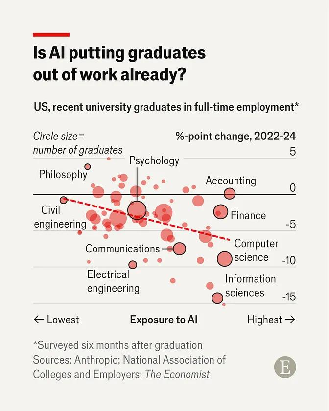

# Is AI putting graduates out of work already? (The Economist, 2026-05)

Scatter plot showing US recent university graduates in full-time employment (surveyed six months after graduation), plotting **%-point change in employment rate 2022–24** against **exposure to AI** by degree field.

Key finding: strong negative correlation — fields with highest AI exposure (Computer science, Information sciences, Finance) saw the largest employment drops (-10 to -15 pp), while low-exposure fields (Philosophy, Psychology) held flat or rose.

## Links

- **Article**: https://www.economist.com/finance-and-economics/2026/05/13/is-ai-putting-graduates-out-of-work-already
- **Sources cited in chart**: Anthropic; National Association of Colleges and Employers; The Economist

## Notes

- Circle size = number of graduates in that field
- Dashed trend line shows clear negative slope across all fields
- Hardest hit: Information sciences (~-15 pp), Computer science (~-10 pp), Electrical engineering (~-12 pp)
- Relatively resilient: Philosophy, Psychology, Accounting (~0 pp)

## Related

- [[ai-jobs-meta-microsoft-2026]]
- [[hbr-ai-intensifies-work]]
