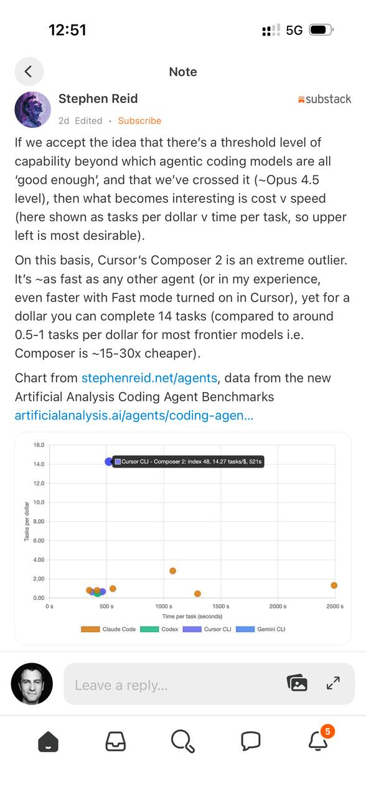

# Coding agents: cost vs speed benchmarks (Stephen Reid)

Interactive table and chart comparing coding agents by **tasks per dollar** vs **time per task**.

## Links

- **Benchmarks page**: https://stephenreid.net/agents
- **Data source**: Artificial Analysis Coding Agent Benchmarks (referenced in announcement)

## Announcement (Substack excerpt)

> If we accept the idea that there’s a threshold level of capability beyond which agentic coding models are all ‘good enough’; and that we’ve crossed it (~Opus 4.5 level), then what becomes interesting is cost v speed (here shown as tasks per dollar v time per task, so upper left is most desirable).
>
> On this basis, Cursor’s Composer 2 is an extreme outlier. It’s ~as fast as any other agent (or in my experience, even faster with Fast mode turned on in Cursor), yet for a dollar you can complete 14 tasks (compared to around 0.5–1 tasks per dollar for most frontier models i.e. Composer is ~15–30x cheaper).
>
> Chart from stephenreid.net/agents, data from the new Artificial Analysis Coding Agent Benchmarks

## What the page shows (light)

A table with agent/model configurations and benchmark components (e.g. SWE-Bench Pro, Terminal-Bench v2) plus derived metrics:

- **Tasks per $**
- **Time per task (seconds)**

It surfaces trade-offs between:
- Absolute capability
- Speed
- Cost efficiency

## Key point

Once models are “good enough” at agentic coding, **economics (cost per task) and latency** become the differentiators — and Cursor Composer 2 appears as a major cost outlier in these numbers.

## Related

- [[gpt-5-5]]
- [[gemma-4]]
- [[boris-cherny-claude-code-tips]]
- [[openclaw]]
