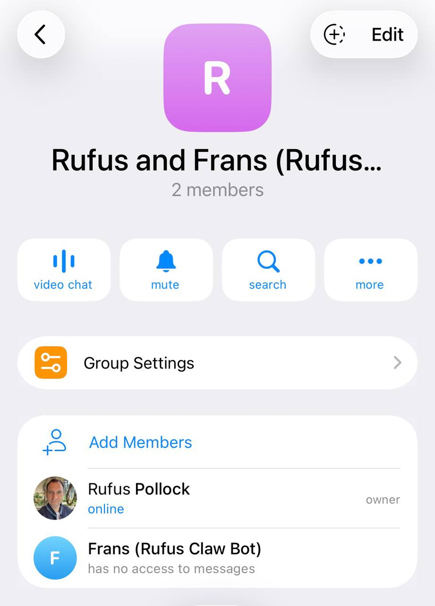

# Multiple Chat Threads with Your AI Agent on Telegram

Working on multiple projects with your AI assistant? You need separate conversations that don't pollute each other's context. A research task shouldn't interfere with code debugging, and email drafts shouldn't mix into your planning session.

This guide shows how to have multiple, parallel, and independent conversations with your AI agent in Telegram using Topics.



## Overview

To have multiple, parallel, and independent conversations (threads) with an OpenClaw AI bot in Telegram, use Telegram's built-in **Topics** feature within a group chat. This allows the bot to maintain separate context for different projects or tasks simultaneously.

Each topic creates an isolated session, so you can have:
- Research in one topic
- Coding tasks in another
- Email drafts in a third
- All running in parallel without context mixing

## Setup Process

### 1. Enable Topics in a Telegram Group

**Create a Group:**
- Create a new Telegram group
- Add your OpenClaw bot to it

**Enable Topics:**
- Go to group settings
- Click the "Edit" menu
- Enable **Topics**
- (This requires the group to be a supergroup, which Telegram will prompt you to upgrade to if necessary)

### 2. Create Multiple Topics (Threads)

Once Topics are enabled, you can create new topics with names like:
- "Research"
- "Coding Task 1"
- "Email Drafts"
- "Interactive Brokers Setup"
- etc.

Each topic functions as an independent conversation thread with separate context.

### 3. Fix Bot Privacy Settings

**The Problem:**

By default, Telegram bots are added to groups in "Privacy Mode" which restricts their access to messages. You'll see "**has no access to messages**" in the members list (see screenshot above).

**The Solution - Choose One:**

#### Option A: Disable Privacy Mode (via BotFather)

1. Open Telegram and message **@BotFather**
2. Send `/setprivacy`
3. Select your bot from the list
4. Choose **Disable**
5. **Important:** Remove the bot from the group and re-add it (required for change to take effect)

#### Option B: Make Bot an Admin (Simpler)

1. In your group, go to group settings
2. Go to **Administrators**
3. Add the bot as an admin
4. Grant at least basic permissions (admin bots can always read messages)

**Recommended:** Option B (make admin) is faster and doesn't require removing/re-adding the bot.

### 4. Configure OpenClaw for Groups

**Update your OpenClaw config:**

```json
{
  "channels": {
    "telegram": {
      "groupPolicy": "open"
    }
  }
}
```

Or use config.patch:

```bash
openclaw config patch --set channels.telegram.groupPolicy=open
```

**Restart OpenClaw** after config change (or it will auto-restart).

## How It Works

**Session Isolation:**
- Each Telegram topic gets its own session key
- Format: `agent:main:telegram:group:{chatId}:topic:{threadId}`
- Context is completely separate between topics
- The bot maintains independent conversation history per topic

**Benefits:**
- Parallel work streams without context pollution
- Switch between projects instantly
- Each thread maintains its own memory and context
- No need for manual context switching

## Technical Details

**OpenClaw Session Keys:**
- General group chat: `agent:main:telegram:group:-1234567890`
- Topic thread: `agent:main:telegram:group:-1234567890:topic:42`
- Each topic ID is unique, ensuring isolation

**Config Options:**

```json
{
  "channels": {
    "telegram": {
      "groupPolicy": "open",           // or "allowlist" with specific groups
      "groups": {
        "-1234567890": {                // optional per-group config
          "requireMention": false,       // respond to all messages
          "topics": {
            "42": {                      // optional per-topic overrides
              "requireMention": true     // override for specific topic
            }
          }
        }
      }
    }
  }
}
```

## Troubleshooting

### Bot doesn't respond to messages

**Check:**
1. Privacy mode disabled (or bot is admin) ✓
2. `groupPolicy` set to "open" (or group in allowlist) ✓
3. Bot is actually a member of the group ✓
4. OpenClaw gateway is running ✓

**Verify in Telegram:**
- Members list should NOT show "has no access to messages"
- Bot should appear as regular member or admin

### Bot responds in wrong topic

This shouldn't happen - OpenClaw isolates sessions by `message_thread_id`. If it does:
- Check OpenClaw logs for session key
- Verify topic IDs are unique
- Report as potential bug

### Want to restrict bot to mentions only

Set `requireMention: true` in config:

```json
{
  "channels": {
    "telegram": {
      "groups": {
        "*": {
          "requireMention": true
        }
      }
    }
  }
}
```

## Use Cases

**Development workflow:**
- "Backend" topic - API design discussions
- "Frontend" topic - UI/UX work
- "DevOps" topic - Deployment scripts
- "Bugs" topic - Debugging sessions

**Research:**
- "Literature Review" topic
- "Data Analysis" topic
- "Writing" topic
- Each maintains separate context and references

**Business:**
- "Finance" topic - accounting, invoices
- "Marketing" topic - campaigns, content
- "Support" topic - customer queries
- "Planning" topic - strategy discussions

## Related Documentation

**OpenClaw Docs:**
- [Telegram Channel Documentation](https://docs.openclaw.ai/channels/telegram)
- [Configuration Reference](https://docs.openclaw.ai/gateway/configuration)
- [Sessions and Context](https://docs.openclaw.ai/concepts/sessions)

**Telegram:**
- [Telegram Topics Documentation](https://telegram.org/blog/topics-in-groups-collectible-usernames)
- [Bot API - Topics](https://core.telegram.org/bots/api#forum-topics)

## Summary

1. Create Telegram group + add bot
2. Enable Topics in group settings (upgrades to supergroup)
3. Fix privacy: disable via BotFather OR make bot admin
4. Set `groupPolicy: "open"` in OpenClaw config
5. Create topics for different work streams
6. Each topic = isolated conversation with separate context

**Result:** Multiple parallel conversations with your AI bot, each maintaining independent context and memory.
